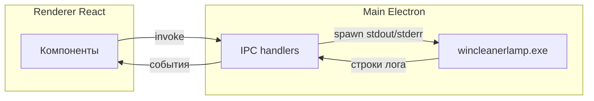

# winCleanerLamp — графический интерфейс (GUI)

GUI — это **десктопное приложение** на **Electron 29**, **React 18**, **TypeScript** и **Material UI (MUI) 5**. Оно не дублирует логику очистки: внутри запускается тот же **`wincleanerlamp.exe`**, что и в CLI, через безопасный **IPC** из главного процесса Electron.

> **Некоммерческий личный проект.** Сделан в первую очередь для удобного сценария «открыл окно — отсканировал — почистил», без обязательств по поддержке. **Автор не несёт ответственности** за сбои, потерю данных или любой вред. Используйте на свой риск после **`--scan` в CLI** или сканирования в GUI.

---

## Зачем GUI, если есть CLI

У консоли полный контроль и скрипты; у GUI — наглядный выбор категорий, переключатель агрессивного режима, лог в реальном времени и вкладки «Система» / «Остатки» без запоминания флагов. Оба варианта используют **один и тот же бинарник** CLI рядом с приложением (в dev — в корне репозитория относительно `gui`).

---

## Возможности интерфейса

| Вкладка / блок | Содержание |
|----------------|------------|
| **Очистка** | Чекбоксы категорий (безопасные и агрессивные), сканирование, очистка с подтверждением, лог вывода |
| **Система** | Вывод `--sysinfo`: крупные системные файлы и подсказки (hiberfil, pagefile, WinSxS и т.д.) |
| **Остатки** | Результат `--leftovers`: отчёт по папкам-кандидатам без автоматического удаления |

Тема оформления: светлая / тёмная (в рамках настроек приложения).

---

## Архитектура (Onion / Clean)

```
gui/src/
├── domain/              # Сущности: категории, результаты сканирования и т.д.
├── application/         # Сценарии (use cases) и порты (интерфейсы сервисов)
├── infrastructure/      # Адаптеры: вызовы Electron IPC
├── presentation/        # React-компоненты и хуки
├── container/           # Сборка зависимостей (ручной DI)
└── shared/types/        # Типы, в т.ч. electron.d.ts

gui/electron/
├── main.ts              # Главный процесс: окно, IPC, spawn wincleanerlamp.exe
└── preload.ts           # Ограниченный мост contextBridge → renderer
```

**Безопасность:** включены **context isolation** и **preload** — страница React не получает прямой доступ к Node.js; только объявленные методы `electronAPI`.

---

## Поток данных (упрощённо)



---

## Требования

- **Windows** (сборка и типичное использование ориентированы на Win x64).
- **Node.js** 20+ и **npm**.
- **Go** 1.21+ — для сборки `wincleanerlamp.exe` в корень репозитория (скрипты `pack` / `dist` делают это автоматически).

---

## Установка зависимостей и разработка

```powershell
cd gui
npm install
```

Скомпилировать main-процесс Electron (нужно перед первым `npm run dev`):

```powershell
npm run build:electron
```

Режим разработки (Vite на порту 3000 + Electron):

```powershell
npm run dev
```

В development `wincleanerlamp.exe` ожидается в **родительской** папке относительно `gui` (корень репозитория). Соберите CLI:

```powershell
cd ..
go build -o wincleanerlamp.exe .
cd gui
```

---

## Production-сборка

Скрипт **`npm run build`** в каталоге `gui`:

- проверяет и собирает TypeScript renderer;
- собирает фронтенд Vite в `gui/dist/`;
- компилирует Electron в `gui/dist-electron/`.

Полный цикл **CLI + GUI + упаковка** (каталог `gui/dist-release/`):

```powershell
cd gui
npm run pack
```

Установщик и portable для Windows:

```powershell
npm run dist
```

`pack` и `dist` сначала выполняют **`build:cli`** (`go build` в `../wincleanerlamp.exe`), затем **`verify:cli`** (проверка, что файл есть — иначе сборка падает с понятной ошибкой), затем `build`, затем **electron-builder**.

Бинарник CLI попадает в **`resources/wincleanerlamp.exe`** рядом с `app.asar` (**`extraResources`** в `package.json`), а не рядом с `WinCleanerLamp.exe`. Главный процесс ищет его в `process.resourcesPath`.

Если CLI уже собран в корне репозитория, достаточно **`npm run dist:electron`** (`verify:cli` + `build` + `electron-builder` без Go). Такой шаг используется в GitHub Actions после отдельного шага `go build`.

---

## Версия приложения

Версия в установщике берётся из **`gui/package.json`** → поле `version`. При релизе через **`npm run release:patch`** (или `minor` / `major`) из корня репозитория npm поднимает версию в корневом `package.json`, затем скрипт **`version`** копирует её в `gui/package.json` и создаётся git-тег `v…` — см. раздел про версии в корневом [`README.md`](../README.md).

---

## Расширение IPC

Если нужен новый метод:

1. Тип в `src/shared/types/electron.d.ts`.
2. Обработчик `ipcMain.handle` в `electron/main.ts`.
3. Экспорт в `electron/preload.ts` через `contextBridge`.
4. Порт в `application/ports/`, адаптер в `infrastructure/`, use case и при необходимости хук в `presentation/hooks/`.

---

## Ограничения и дисклеймер

- GUI **не отменяет** риски удаления данных: это оболочка над CLI.
- Агрессивные категории требуют явного включения в UI; всё равно читайте описание категорий в [docs/cli.md](cli.md).
- Проект **не коммерческий**; претензии к «службе поддержки» не предусмотрены.

Если что-то пошло не так — в первую очередь проверьте лог в окне и запуск `wincleanerlamp.exe` из той же папки вручную в консоли.
